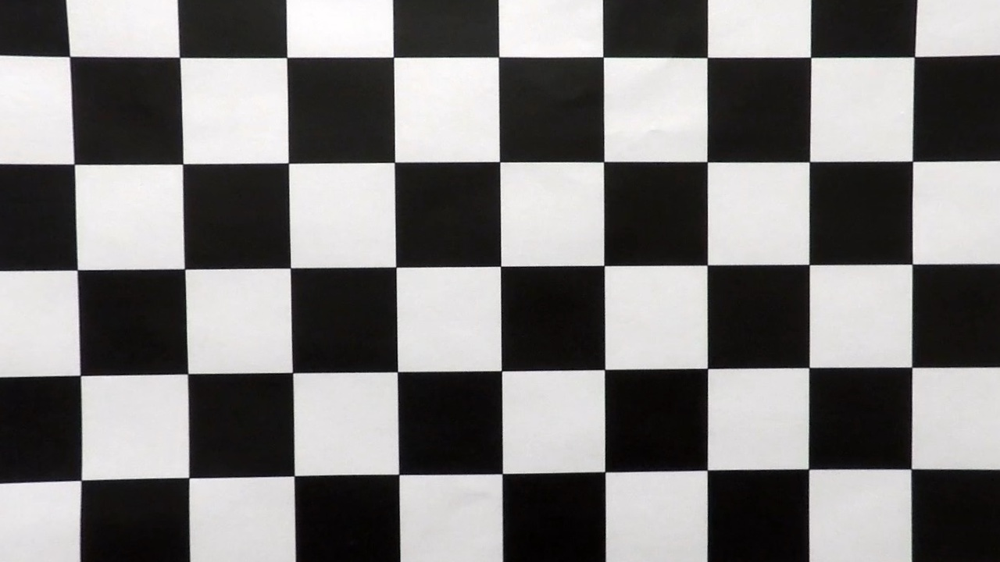
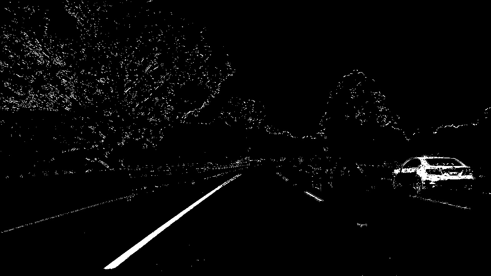
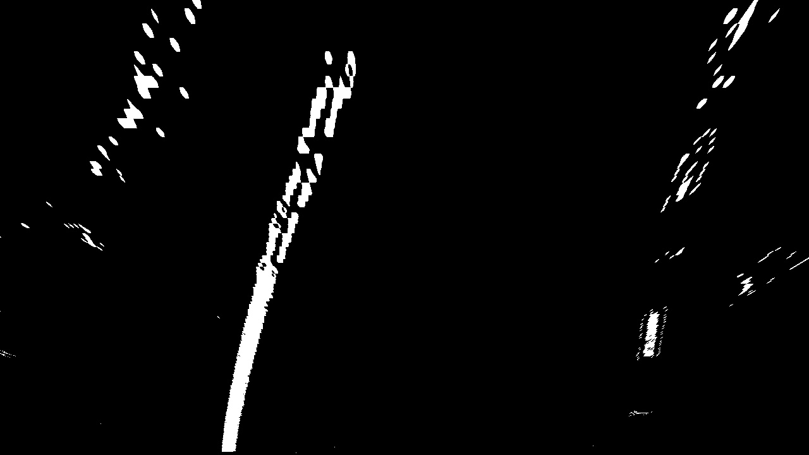
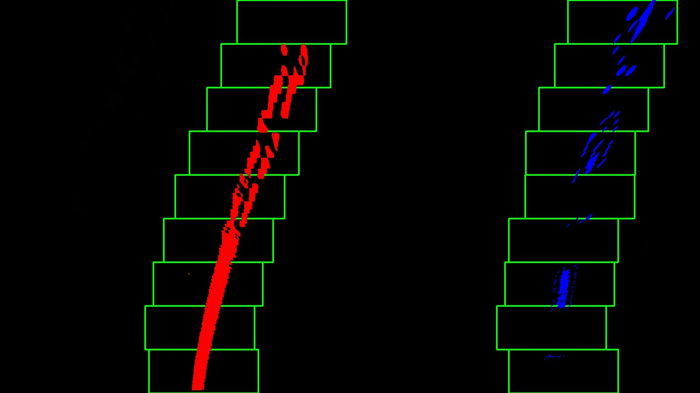

## Writeup Template

### You can use this file as a template for your writeup if you want to submit it as a markdown file, but feel free to use some other method and submit a pdf if you prefer.

---

**Advanced Lane Finding Project**

The goals / steps of this project are the following:

* Compute the camera calibration matrix and distortion coefficients given a set of chessboard images.
* Apply a distortion correction to raw images.
* Use color transforms, gradients, etc., to create a thresholded binary image.
* Apply a perspective transform to rectify binary image ("birds-eye view").
* Detect lane pixels and fit to find the lane boundary.
* Determine the curvature of the lane and vehicle position with respect to center.
* Warp the detected lane boundaries back onto the original image.
* Output visual display of the lane boundaries and numerical estimation of lane curvature and vehicle position.

[//]: # (Image References)

[image1]: ./examples/undistort_output.png "Undistorted"
[image2]: ./test_images/test1.jpg "Road Transformed"
[image3]: ./examples/binary_combo_example.jpg "Binary Example"
[image4]: ./examples/warped_straight_lines.jpg "Warp Example"
[image5]: ./examples/color_fit_lines.jpg "Fit Visual"
[image6]: ./examples/example_output.jpg "Output"
[video1]: ./project_video.mp4 "Video"

## [Rubric](https://review.udacity.com/#!/rubrics/571/view) Points

### Here I will consider the rubric points individually and describe how I addressed each point in my implementation.  

---

### Writeup / README

#### 1. Provide a Writeup / README that includes all the rubric points and how you addressed each one.  You can submit your writeup as markdown or pdf.  [Here](https://github.com/udacity/CarND-Advanced-Lane-Lines/blob/master/writeup_template.md) is a template writeup for this project you can use as a guide and a starting point.  

You're reading it!

### Camera Calibration

#### 1. Briefly state how you computed the camera matrix and distortion coefficients. Provide an example of a distortion corrected calibration image.

The code for this step is contained in the first code cell of the IPython notebook located in "./examples/example.ipynb" (or in lines # through # of the file called `some_file.py`).  

I start by preparing "object points", which will be the (x, y, z) coordinates of the chessboard corners in the world. Here I am assuming the chessboard is fixed on the (x, y) plane at z=0, such that the object points are the same for each calibration image.  Thus, `objp` is just a replicated array of coordinates, and `objpoints` will be appended with a copy of it every time I successfully detect all chessboard corners in a test image.  `imgpoints` will be appended with the (x, y) pixel position of each of the corners in the image plane with each successful chessboard detection.  

I then used the output `objpoints` and `imgpoints` to compute the camera calibration and distortion coefficients using the `cv2.calibrateCamera()` function.  I applied this distortion correction to the test image using the `cv2.undistort()` function and obtained this result: 



### Pipeline (single images)

#### 1. Provide an example of a distortion-corrected image.

To demonstrate this step, I will describe how I apply the distortion correction to one of the test images like this one:


#### 2. Describe how (and identify where in your code) you used color transforms, gradients or other methods to create a thresholded binary image.  Provide an example of a binary image result.

I used a combination of color and gradient thresholds to generate a binary image (thresholding function pipeline() at In[21] cell in 'Advanced Lane Finding' IPython notebook).  I have combined S channel, R channel, x sobel and y sobel threshold to obatain a combimed threshold. Here's an example of my output for this step.  (note: this is not actually from one of the test images)



#### 3. Describe how (and identify where in your code) you performed a perspective transform and provide an example of a transformed image.

The code for my perspective transform includes a function called `transform()`, which appears in the In[4] cell of the IPython notebook.  The `transform()` function takes as inputs an image (`img`), as well as source (`src`) and destination (`dst`) points.  

I chose the initial hardcode for the source and destination points in the following manner:

```python
src = np.float32(
    [[(img_size[0] / 2) - 55, img_size[1] / 2 + 100],
    [((img_size[0] / 6) - 10), img_size[1]],
    [(img_size[0] * 5 / 6) + 60, img_size[1]],
    [(img_size[0] / 2 + 55), img_size[1] / 2 + 100]])
dst = np.float32(
    [[(img_size[0] / 4), 0],
    [(img_size[0] / 4), img_size[1]],
    [(img_size[0] * 3 / 4), img_size[1]],
    [(img_size[0] * 3 / 4), 0]])
    
```

Then I used the two straight line images to fine tune the source points, and the final results are the following:

This resulted in the following source and destination points:

| Source        | Destination   | 
|:-------------:|:-------------:| 
| 199, 720      | 320, 0        | 
| 594, 450      | 320, 720      |
| 689, 450     | 960, 720      |
| 1114, 460      | 960, 0        |

I verified that my perspective transform was working as expected by drawing the `src` and `dst` points onto a test image and its warped counterpart to verify that the lines appear parallel in the warped image.



#### 4. Describe how (and identify where in your code) you identified lane-line pixels and fit their positions with a polynomial?

The function to identify lane-line pixels is find_lane_pixels(), in In[5] cell, based on the following searching methodology.

Step 1. Measure the histogram of the bottom half of the images to identify the base points for the left and right lane respectively. 
Step 2. Divide the image in nine equal sections, with each's height equals to 80. Starting at center points as the left and base points, shift a window upwards with width = 100 and height = 90.
Step 3. If the total pixels inside the window is larger than or equal to 50, re-center the window based on the points that fall inside the window. If the total pixels inside the window is less than 50, keep privious center point and shift up towards next section.
Step 4. After the pixels in the windows are all deteced, marked these points.

The function to fit pixels positions with a polynomial is in fit_polynomial(), in In[26].The left lane and right lane are fitted with a 2nd order ploynomial like this:

x = a*(y^2) + b*y + c

And the fitted lanes are as like the following:




#### 5. Describe how (and identify where in your code) you calculated the radius of curvature of the lane and the position of the vehicle with respect to center.

I did this in lines # through # in my code in `my_other_file.py`

I calculated the radius of curvature of the lane and position to the vehicle with respect to center in the function measure_curv(), in In[15] cell.


#### 6. Provide an example image of your result plotted back down onto the road such that the lane area is identified clearly.

I implemented this step in  In[8] cell in the function `display_lane()`.  Here is an example of my result on a test image:


---

### Pipeline (video)

#### 1. Provide a link to your final video output.  Your pipeline should perform reasonably well on the entire project video (wobbly lines are ok but no catastrophic failures that would cause the car to drive off the road!).

Here's a [test_video_output/project_video_output.mp4 ](test_video_output/project_video_output.mp4)

---

### Discussion

#### 1. Briefly discuss any problems / issues you faced in your implementation of this project.  Where will your pipeline likely fail?  What could you do to make it more robust?

Here I'll talk about the approach I took, what techniques I used, what worked and why, where the pipeline might fail and how I might improve it if I were going to pursue this project further.  

For the perspective transform, I applied canny detection to the straight line images first, and used the detected lines to help hardcode the source points. Although this approach works fine in this case, it is not the best. Some transpective transform algorithm that can detect sources points automatically could be explored.

For the image threshold, I combined color and gradient threshold, as the following:

(R_channel & S_channel) | (x_sobel & y_sobel)

This works fine for the project video, but it would require further tuning when confronted more complex situation, (for instance, light road surface under strong light)

For the pixel identification and lane-line pixel finding, the slidng window method works perfectly for the solid line. However, when coming for the dashed line, it turned to less stable. A better approach for the dashed line could be explored, for instance, convolution.